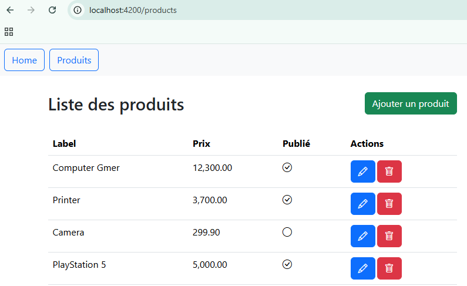
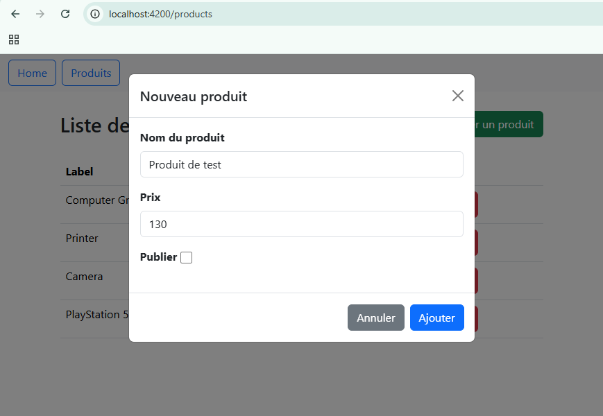
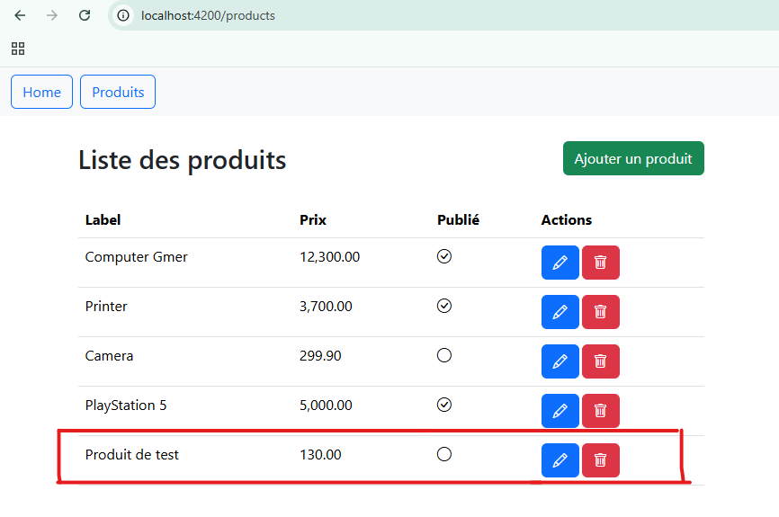
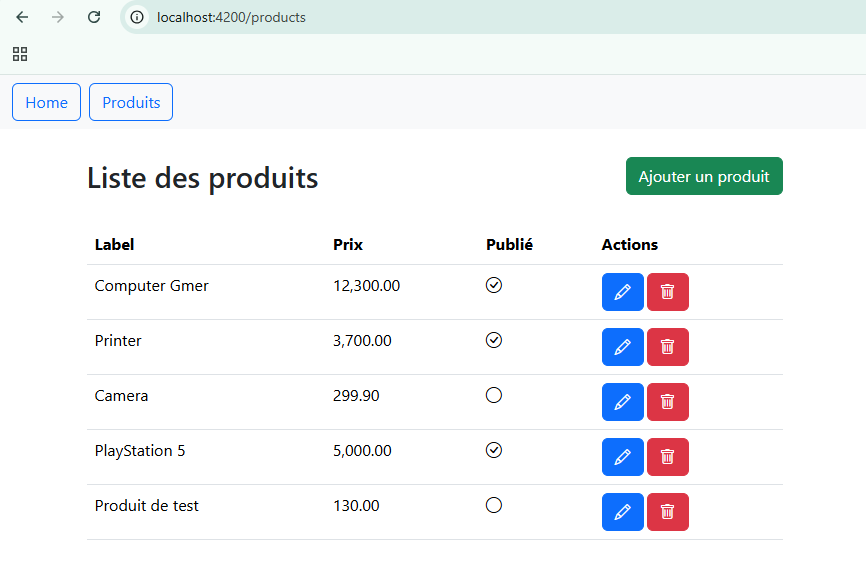
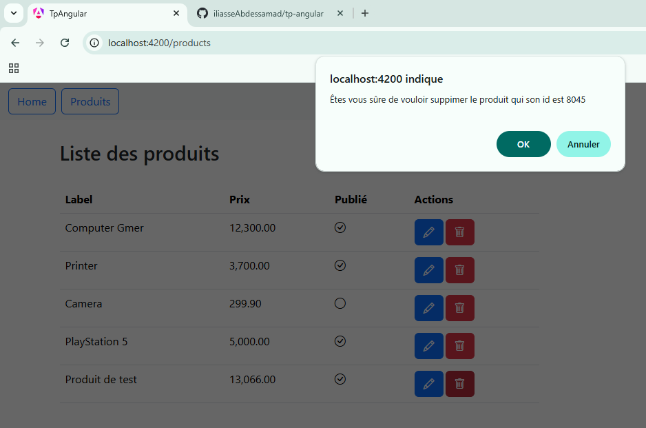

# 📚 -- TP Angular

L'objectif de ce TP, est de se familiariser avec les concepts de base du **Framework Angular**, via la 
réalisation d'une application de gestion de produits.

## 📦 Dépendences de l'application

**Angular 20** : Framework javascript pour le rendu HTML côté client <br />
**bootstrap 5** : Intégration de bootstrap css et bootstrap js <br />
**bootstrap-icons** : Intégration des icones bootstrap <br />
**json-server** : Simulation de la partie back-end de l'application <br />
**db.json** : Un fichier au format json, ajouté dans la racine du projet, et qui simule une base de données

<br />
## 📌 Démo

1 - Installez <a href="https://nodejs.org/en/download">**NodeJs**</a> s'il n'est pas déjà installé, après son installation tapez les commandes suivantes qui deveront afficher réspectivement la version de **NodeJs**, et du gestionnaire de dépendences **npm**
```
node -v 
npm -v
```

2 - Clônez le dépôt : 
```
git clone https://github.com/iliasseAbdessamad/tp-angular.git
```

2 - Accédez au répertoir racine du projet :
```
cd your_home_directory/tp-angular
```

3 - Installez les dépendences de l'application : 
```
npm install
```

4 - Lancez l'application : 
```
npx ng serve
```

<br />

## 🏁 Opérations CRUD :  

<br />

### Accédez à la page "Produits :



Une fois que vous naviguez vers la page `Produits` :
1 - **RouterModule** intercepte le clique, change l'URL, et cherche une correspondance de route depuis le fichier `app.routes.ts` 
2 - Dans notre cas, il trouve que l'url "/products" correspond à `ProductComponent`
3 - Angular Crée ce composant en injectant les dépendences necessaires (ProductService, ...), appelle la méthode `ngOnInit`, 
et injecte `product.html` dans l'élément **router-outlet** d'angular
4 - L'objet `productService` va faire un appel HTTP vers le backend `json-server` via **HttpClient**
5 - L'état du modèle `ProductModel[]` sera modifié
6 - Et grâce au **Data Binding** d'Angular, cet nouvel état va être refletée dans la vue `product.html`  

<br />

### Cliquez sur le boutton "Ajouter un produit" pour afficher le formulaire d'ajout :



<br />

### Cliquez sur le boutton "Ajouter" pour ajouter ce nouveau produit :



<br />

### Cliquer sur le boutton "Editer" pour afficher le formulaire de mise à jour d'un produit :



<br />

### Cliquer sur le boutton "Mettre à jour" pour enregistrer les modifications :


<br />

### Cliquez sur le boutton "Supprmier" pour supprimer un produit :



<br />

### Confirmez la suppréssion :


<br />
<hr />
<br />
<p>🧑‍💻<b>Réalisé par : </b>Abdessamad Iliasse</p>
<p>📚 <b>Sujet : </b>Angular Framework</p>
<p>📅 <b>Année : </b>2024 - 2025</p>

